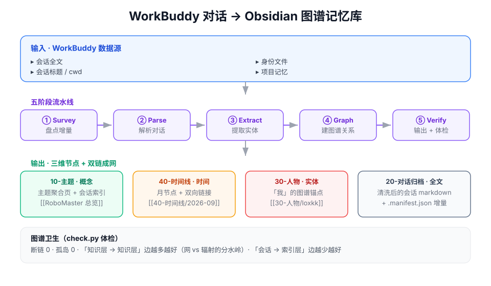

# WorkBuddy Memory Vault · 记忆库生成器

[](LICENSE)
[](https://github.com/Lo2xKK/workbuddy-memory-vault-skill/actions/workflows/ci.yml)
[](https://www.python.org/)
[](CHANGELOG.md)
[](https://www.workbuddy.cn/)

把 **WorkBuddy** 的记忆与历史对话，编译成 **Obsidian 图谱记忆库**——按「主题 / 时间 / 人物」三个维度自动建立节点与双链关联。

<p align="center">
  
</p>

## 它解决什么

- **找得到**——对话按「主题 / 时间 / 人物」三个维度成网，全文可检索；体检指标是断链 0、孤岛 0。
- **带得走**——产物是你本地 vault 里的纯 markdown + frontmatter，不锁定任何平台。
- **读得下**——原始记录里 95% 是工具调用与推理日志；清洗后归档只留有价值的对话正文。
- **可重复**——幂等 + 增量，重跑只覆盖自己的产物，不碰 `~/.workbuddy/` 的原始数据。

## 设计理念

四条主张：**编译而非堆积**（产物是给人读的笔记，不是搬运的原文）；**四层职责分离**（索引层只做导航、知识层承载结论、原料层忠实记录、原始层不参与图谱）；**图谱卫生是硬指标**（知识层 ↔ 知识层的边越多越好，索引层的边越少越好）；**前提决定手段**（WorkBuddy 把结构留在了本地，所以用确定性解析，而不是靠启发式去猜）。

> 完整论证、同类方案对比、真实产物样例与工程取舍 → **[docs/设计论述.md](docs/设计论述.md)**

## 快速开始

```bash
# 1. 复制脚本进你的 vault（本仓库即 skill 包 workbuddy-memory-vault-skill）
cp -r scripts/* <你的vault>/_tools/
# 2. 复制配置模板并改成自己的（topics.json 已 gitignore）
cp config/topics.example.json <你的vault>/_tools/topics.json
# 3. 先空转预览分类，确认无误后正式生成
python <你的vault>/_tools/ingest.py --list
python <你的vault>/_tools/ingest.py
# 4. 体检（目标：断链 0、孤岛 0）
python <你的vault>/_tools/check.py
```

用 managed Python（Windows）：`~/.workbuddy/binaries/python/versions/3.13.12/python.exe`（替换成你的实际用户名路径）

## 命令行参数

| 参数 | 作用 |
|---|---|
| `--list` | 空转，只列会话与分类，不写文件 |
| `--full` | 忽略 `.manifest.json`，强制全量重建 |
| `--vault <目录>` | 指定输出 vault（默认自定位） |
| `--only <ID前缀>` | 只同步一个会话（调试） |
| `--no-raw` / `--no-tools` / `--no-memory` / `--no-timeline` / `--no-person` | 分别跳过：原始 jsonl 备份 / 工具调用轨迹 / `30-我的记忆/` / `40-时间线/` / `30-人物/` |

**幂等**：只覆盖自己生成的文件（`generated_by: ingest.py` 标记），绝不碰手工目录。**只读**：不修改 `~/.workbuddy/` 下任何东西。**增量**：`.manifest.json` 按 mtime 跳过未变更的会话。

## 目录结构与四层职责

```
<vault>/
├── 00-总览/            索引层：只做导航，绝不写细节
├── 10-主题/            知识层：结论 / 卡片 / 会话索引
├── 20-对话归档/        原料层：会话全文（机器生成，不手改）
├── 30-我的记忆/        原料层：身份快照 / 用户画像 / 项目记忆
├── 30-人物/            实体层：人物节点（「我」的图谱锚点）
├── 40-时间线/          时间层：月节点（会话 ↔ 月双向链接）
├── 90-原始数据/        原始 jsonl（务必 gitignore）
├── .manifest.json      增量台账
└── _tools/             ingest.py + check.py + topics.json
```

## 配置（topics.example.json → topics.json）

仓库只分发通用模板 `config/topics.example.json`；复制成 `topics.json` 后改成自己的（已 gitignore）。找不到 `topics.json` 时会自动回退到模板，零配置也能跑出结果。

```json
{
  "person":          { "name": "我", "label": "我" },
  "topics":          { "工程与工具": { "note": "工程与工具 总览", "label": "工程与工具" } },
  "rules":           [ { "topic": "工程与工具", "match": ["skill", "github", "mcp"] } ],
  "default":         "日常与运维",
  "projects":        { "d:\\path\\to\\your-project": "项目名" },
  "project_default": "临时工作区",
  "memory_roots":    ["D:/path/to/你的工作区根目录"],
  "title_overrides": { "<session-id 前缀>": "人工标题" }
}
```

`rules` 顺序匹配、先中者胜，对「标题 + cwd」做包含判断；改完先跑 `--list` 空转看分类。

## 数据与隐私

本仓库只开源**导入脚本与结构**，不含任何对话正文；工具也只**读取** `~/.workbuddy/`，不改动你的原始数据。你生成的 `90-原始数据/` 会含本机路径等个人信息——**若要上传公开平台，请先排除该目录**（`20-对话归档/` 是清洗后的全文，也建议一并过一眼）。

## 已知局限

「人物」维度目前只有「我」一个节点；主题分类是关键词匹配而非语义理解；增量判断依赖 jsonl 的 `mtime`。三条都是**当前的设计选择**而非待修的 bug，详述见 [设计论述 · 工程取舍与边界](docs/设计论述.md#六工程取舍与边界)。

## 开发与测试

```bash
pip install pytest
pytest -q                 # 35 个单测，只覆盖纯函数，不读真实数据
python -m py_compile scripts/*.py
```

单测在 `tests/`，CI（Python 3.10 / 3.12 / 3.13 矩阵）在每次 push 与 PR 时自动执行。参与开发前请先读 [CONTRIBUTING.md](CONTRIBUTING.md)（环境准备 / 目录约定 / PR 流程 / 隐私红线）。

## License

MIT
